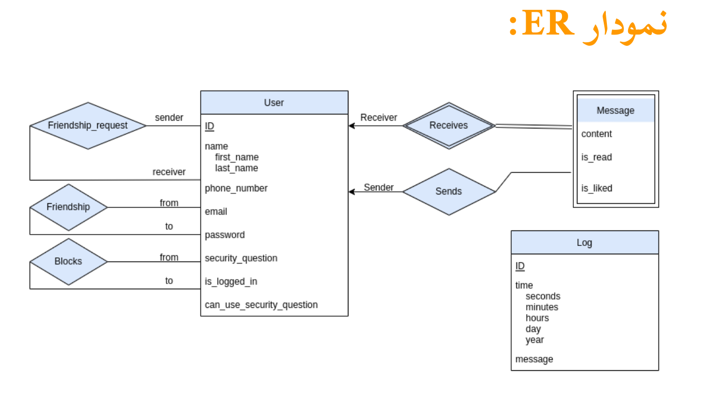

# final_university_db_project
##  Project Description 
* this is the final project of the course priciples of Database Design .
* the goal of this project would be to design a backend chat application which implemented by python and mysql as primary database 
* the most considerable part in this project is  not to use  any framework to hanlde the jobs . all the requestes are handeled by database Raw Queries 
* requests are used in this project are exported by postman json file . you can easily import and make use of .
<p align="center">
  
</p>
## buildig and running by Dockerizing 
```
docker-comopse up -d 

```
## local running 
### instaling python and pip 
```
sudo apt-get install python3-pip
```
### installing project depndencies 
```
python3 -m venv venv
source venv/bin/activate
pip3 install -r requirements.txt
```
### Running project locally 
```
python3 main.py run_app
```
